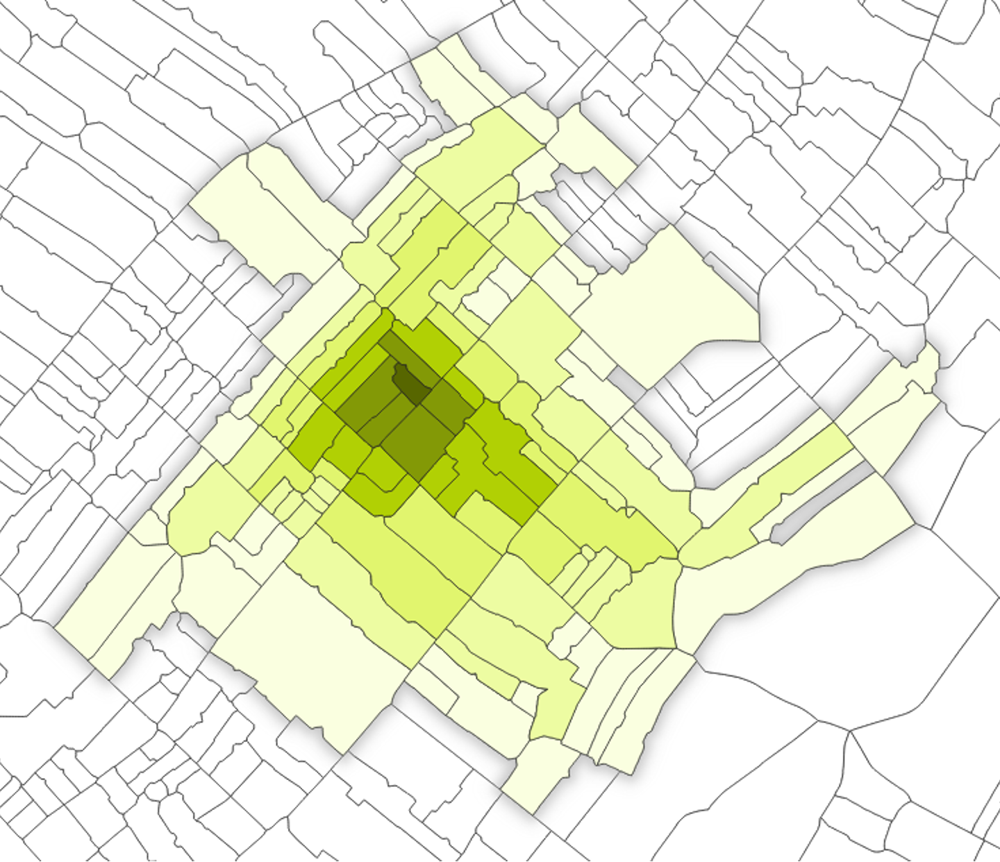

---
output:
  bookdown::pdf_document2:
    template: templates/brief_template.tex
    citation_package: biblatex
    latex_engine: pdflatex
  #bookdown::word_document2: default
  #bookdown::html_document2: default
documentclass: book
bibliography: references.bib
---

# Methodology {#methods}

\minitoc <!-- this will include a mini table of contents-->

This chapter describes the methods used to complete the analyses and to obtain the results of this research. First the general process followed to generate spatial segmentations based on urban morphology is described, before the specific differences between seven different particular segmentations and the methodology used to compare these are each set out.

The aim of the spatial segmentation process is to partition a city into areas with similar urban morphology. To do this, various components of urban morphology ('characters') are measured at a small scale throughout the city. The 'base spatial unit' is the small-scale area at which these characters are (generally) measured and reported. The units with similar values for these morphometric characters are then grouped ('clustered'), thereby aggregating the base spatial units into larger areas with similar urban morphology.

## Base spatial units {#base-spatial-units}

In the process of constructing each spatial segmentation, the urban area is first divided into many small spatial units (the OTU as discussed in the [previous chapter](#spatial-unit)). These are then used as the building blocks from which the consequent classification of urban space is constructed. When these base spatial units are changed, the ways in which urban morphology is measured and clustered are changed and thus the resultant spatial segmentations change.

### Morphological tessellation

As discussed in the [previous chapter](#spatial-unit), morphological tessellation uses the building footprints to generate a large number of fine-grain spatial units suitable for measuring features of urban morphology, consequently clustering these to create segmentations which reflect different urban tissues.

The spatial units created (MT cells) are produced by generating Voronoi polygons around each building, thereby exhaustively dividing the space in question according to the nearest building to any given point. In this dissertation this process is implemented in Python using the `momepy` package [@fleischmann2019].

Because of the minimal data requirement (the only data required are building footprints and the boundary of the area in which to generate the tessellation), MT can be used in a wide range of geographical contexts. For example, MT cells could be generated using building footprints derived purely from satellite or aerial imagery.

#### Data: buildings from the Spanish Cadastre

The buildings used to generate tessellation cells are taken from open data provided by the Spanish Cadastre (*Dirección General del Catastro*), an administrative registry which records the physical and legal characteristics of every property in Spain. Because of this administrative purpose and governmental mandate, the dataset has near-complete coverage at the national level. All unprotected data for each property can be downloaded free of charge, either directly from the [Cadastre website](http://www.sedecatastro.gob.es/) or through an API or tool such as the [Spanish Inspire Catastral Downloader plugin for QGIS](https://plugins.qgis.org/plugins/Spanish_Inspire_Catastral_Downloader/) [@soriano2021]. The data provide detailed information about each building, including the building's exact location, year of construction, height, footprint, and the number of residential units within the building.

These data have been used in previous geographic data science research: @arribas-bel2019 used them to delineate improved boundaries for urban areas, while @carpio-pinedo2021 used the data to map land use mix as 'walkable trips'. Because the dataset is formulated in accordance with the European INSPIRE (Infrastructure for Spatial Information in the European Community) directive, replicability studies could be relatively straightforward for other European countries with equivalent data.

<!--# maybe don't need all this detail -->

The data are provided as three different datasets: Cadastral Parcels (CP) describe "the basic unit of ownership" (i.e. the plot) irrespective of whether it has been built upon; Addresses (AD) provides identifiers for the location of each property; and Buildings (BU) gives geospatial information about each building.

<!--# map of buildings vs building parts (vs cadastral parcels) -->

### Enclosed tessellation

Enclosed tessellation (ET) is an alternative to morphological tessellation which makes use of road network data in addition to building footprints.

The first step in creating the ET is to generate enclosures from the street network and city boundary. These areas are similar to the Sanctuary Area used in previous studies of urban form [@mehaffy2010; @dibble2019], albeit they are constructed of all drivable roads and not solely of main roads. Within each of these enclosures, Voronoi polygons are generated around each building, partitioning the space within each enclosure according to the nearest building to create enclosed tessellation cells. Like MT, the ET cells were generated in Python using `momepy`.

Because this is ultimately a segmentation of housing submarkets, ET cells containing no buildings are dropped at this stage. This means that unlike MT, the segmentation is not spatially exhaustive: certain areas without buildings are excluded from the final classification (commonly roundabouts and the central reservations of dual carriageways). This difference is discussed at greater length in the [Discussion](#morphological-and-enclosed-tessellation). Figure \@ref(fig:making-ET) shows the process of generating enclosed tessellation cells.

```{r making-ET, echo=FALSE, fig.cap="Generating enclosed tessellation: input buildings (dark green) and roads (red) data; plotting Voronoi polygons around each building within the enclosures formed by the roads; final tessellation.", fig.scap="Generating enclosed tessellation.", message=FALSE, fig.align='center', out.width="32%", fig.show = 'hold'}
knitr::include_graphics(c("figures/making ET/a.png",
                          "figures/making ET/b.png",
                          "figures/making ET/c.png"))
```

#### Data: roads from OpenStreetMap

The road network is taken from the collaborative online OpenStreetMap (OSM) project. OSM is a relatively novel source of volunteered geographic information, but since its 2004 inception has already been used in a wide range of geographical research [@openstre2015]. Although there have been questions raised about the quality and completeness of crowdsourced geospatial data [@mooney2017], studies of OSM's road network have found a high level of completeness [@barrington-leigh2017] and so this is unlikely to be a problem, particularly in prominent urban areas in an economically developed country such as Spain.

The `OSMnx` Python package [@boeing2017] is used to query the Overpass OSM application programming interface (API) and return all roads marked as drivable by general vehicular traffic[^methods-1] within a 100 metre buffer around the boundary of the city.

[^methods-1]: Specifically, the function used to return 'drivable' roads removes all routes tagged as `abandoned`, `bridleway`, `bus_guideway`, `construction`, `corridor`, `cycleway`, `elevator`, `escalator`, `footway`, `path`, `pedestrian`, `planned`, `platform`, `proposed`, `raceway`, `service`, `steps`, `track`, `alley`, `driveway`, `emergency_access`, `parking`, `parking_aisle`, or `private`; `motor_vehicle = no`, and `motorcar = no`. See the [source code](https://github.com/gboeing/osmnx/blob/c350658302ff513a6534e68da38c5ec71b1b0769/osmnx/downloader.py#L46-L56) for further detail.

### Blocks

The block is a similar unit to the enclosures used in the process of generating ET cells, being delineated by the street network provided. They differ from enclosures in that blocks are built back up from ET cells, and so do not include those spaces surrounded by streets but not containing any building. Blocks are again generated using `momepy`.

### H3

H3 [@brodsky2018] is a hierarchical, hexagonal, global grid system initially developed by Uber Technologies to process and visualise the large amounts of spatial data they collect. It completely partitions the surface of the Earth into hexagons derived from a projection of the globe as a spherical icosahedron. For this reason each hexagonal H3 cell has approximately the same area as any other at the same resolution; the H3 grid does not suffer from the same problems of latitude-dependent size distortion a square grid on a Mercator projection would have. H3 was implemented using the `h3` Python bindings. A cell resolution of 10 is used, at which level each cell has an edge length of 65.9 metres and an area of 15,047.5 m^2^.

```{r h3-globe, fig.align='center', fig.cap="H3 partitions the globe into (mostly) hexagonal cells. Source: Brodsky (2018).", fig.scap="H3 partitions the globe into hexagonal cells.", out.width="65%", message=FALSE, echo=FALSE}
knitr::include_graphics("figures/h3-globe.png")
```

<!--# [will talk more about the benefits/drawbacks of H3 in the discussion section] -->

Figure \@ref(fig:spatial-units) compares each of the four base spatial units employed in the dissertation.

```{r spatial-units, echo=FALSE, fig.cap="Different base spatial units: morphological tessellation, enclosed tessellation, blocks, and H3.", fig.scap="Different base spatial units.", message=FALSE, fig.align='center', out.width="48%", fig.show = 'hold'}
knitr::include_graphics(c("figures/units/MT.png",
                          "figures/units/ET.png",
                          "figures/units/blocks.png",
                          "figures/units/H3.png"))
```

## Measuring morphometric characters

The characters used as inputs when carrying out spatial segmentation are the data which determine the ultimate segmentations, and so it is imperative that these successfully capture the desired features: in this study, the morphology of an area.

In clusterings which use the full set of characters (see Table \@ref(tab:characters-table)) there are three different elements on which characters are measured: buildings, tessellation cells, and blocks. Some characters---such as the area of the element---can be measured on all three elements, while others---such as the coverage area ratio, which reports the proportion of a tessellation cell covered by a building---can only be measured on (a) certain element(s).

#### Data: building information from the Spanish Cadastre; roads from OpenStreetMap

The two data sources used to generate morphometric characters are those already introduced: the Spanish cadastral dataset, and the drivable roads from OSM.

The cadastral dataset provides multiple forms of geospatial information about each building: `Building` describes the geometry and attributes of each building, while the more granular `BuildingPart` gives separate information about the constituent parts of buildings, including the height of each part. This height (used to calculate several morphometric characters) is derived from the `numberOfFloorsAboveGround` attribute, which is multiplied by three to approximate a height value in metres (assuming that each floor is approximately three metres tall). As the attribute is only provided for `BuildingPart`s, a spatially weighted average of the heights of each building's constituent parts is calculated to produce height information for each building. Before this was done, the `numberOfFloorsAboveGround` attribute was manually inspected and corrected in certain cases: for example some building parts reported a value of 106, despite the tallest building in Barcelona only having 44 floors.

<!--# could also include a formula if I have the time (https://pysal.org/tobler/generated/tobler.area_weighted.area_interpolate.html) -->

### Primary characters

Each primary character quantifies an aspect of urban morphology with respect to a particular element (as described above). As wide a range of characters as reasonably possible is initially calculated in order to capture as many different aspects of urban form as possible. The primary characters are calculated using `momepy`. The initial set of characters is detailed in Table \@ref(tab:characters-table). The character descriptions are primarily adapted from Fleischmann (2021) @fleischmannUrbanAtlasMethodological2021 and `momepy` documentation.

```{r characters-table, fig.cap="Initial set of urban morphometric characters. Those included in the H3 clustering are indicated with *.", fig.scap="Initial set of urban morphometric characters.", message=FALSE, echo=FALSE}
library(knitr)
library(tidyverse)
library(kableExtra)
library(readr)
primary_chars <- read_csv("figures/primary chars.csv")

primary_chars %>% 
  mutate(H3 = replace_na(H3, "")) %>%
  kable(booktabs = TRUE, 
        caption="Initial set of urban morphometric characters. Those included in the H3 clustering are indicated with '*'.",
        caption.short = "Initial set of urban morphometric characters.") %>%
  kable_styling(latex_options = "scale_down") %>%
  column_spec(4, width = "18em") %>% 
  column_spec(2, width = "14em")
```

### Selecting characters

The information provided by each character must vary spatially, that is to say that if the values of a character are randomly distributed throughout a city or do not vary at all, the character is not useful in a *spatial* segmentation, which is premised on dividing the city based on the ways in which given input values vary over space. For this reason, the spatial autocorrelation of each character throughout the study area is assessed by calculating the Global Moran's *I*. If this is not statistically significant, the character is not spatially autocorrelated and therefore is discarded. All characters used in the segmentations were found to exhibit significant spatial autocorrelation (positive Moran's *I* value and *p* \< 0.005).

A degree of correlation is expected between certain characters, but if multiple characters are highly correlated this may be indicative of two or more characters representing essentially the same concept, thus not providing a significant amount of additional information and skewing the results of the clustering. For this reason, the degree of correlation between each of the characters is inspected. As the distributions of values in each character is not necessarily normal, Spearman's rank correlation coefficient is computed to quantify the degree to which each character is correlated to each other character. Figure \@ref(fig:correlation-matrix) provides an example of this process for the characters generated on ET cells.

```{r correlation-matrix, echo=FALSE, fig.cap="Correlation matrix of morphometric characters.", out.width="100%", message=FALSE, fig.align='center'}
library(tidyverse)
knitr::include_graphics("figures/ET_correlations.pdf")
```

On the basis of Figure \@ref(fig:correlation-matrix), four characters were removed on the basis of exhibiting too high a degree of collinearity: `blg_CentroidCornersMean`, `blg_Perimeter`, `blk_Perimeter`, and `blk_CompactnessWeightedAxis`.

### Contextual characters {#contextual-characters}

As there is no explicitly spatial input to the clustering algorithm used (for all but one of the segmentations), there is no guarantee that any clusters generated from purely the primary characters will form spatially contiguous areas (that is, the eventual spatial segmentations). Furthermore, since the base units are small (particularly in the case of ET/MT cells, which only delineate the area around a single building) they cannot uniquely capture the morphology of the urban tissue to which they belong. The use of spatial weights to incorporate information about the neighbouring spatial units therefore expands the geographic extent of morphometric information supplied while preserving the spatial granularity provided by the base units in a way which would not be achieved by simply aggregating the characters to less granular spatial units.

When used with ET/MT cells, the contextual characters also reflect how humans perceive (urban) space. While the measured geographic distance may be equal, a person's mental conception of the distance between two points will be different if the area between these is a built environment with a high density of streets and buildings, compared to an open landscape with fewer roads or features. Using topological steps based on ET/MT cells can therefore be seen as a more theoretically sound reflection of the relationship between different elements than a simple distance buffer or *k* nearest neighbours, and a better way to describe the morphology of the vicinity of a given cell [@fleischmann2020tessellation].

```{r spatial-weights, fig.align='center', fig.cap="An example of the topological neighbours used to create contextual characters for a tessellation cell: the darkest green is the original cell and each shade lighter represents one extra degree of topological distance from this cell.", fig.scap="Neighbours of a tessellation cell.", out.width="65%", message=FALSE, echo=FALSE}

```

To generate contextual characters, a spatial weights matrix is created for the base spatial unit: this records which cells are neighbours of a given cell. The definition of 'neighbour' in this context depends on the number of topological steps stipulated when computing the spatial weights (the order of contiguity, *k*). If *k* = 1, queen contiguity-based spatial weights are used such that any cell sharing a common edge or vertex is counted as a neighbour. If *k* $\leq$ 2, the spatial weight will define as a 'neighbour' both the cells included as neighbours in the *k* = 1 criterion and *their neighbours* according to the same criterion, and so on such that as *k* increases so does the maximum number of topological steps between a cell and its 'neighbour' (see Figure \@ref(fig:spatial-weights)).

For each character and each cell, the interquartile mean (IQM) is then calculated from that character's values in all cells defined as a neighbour in the spatial weights matrix provided. The IQM is calculated by taking the mean average of all values between the lower and upper quartile when ordered, and as such is less affected by outliers than a simple mean of all values.

## Clustering

In all but one segmentations presented in this dissertation, the clustering of cells into urban tissues was carried out using a Gaussian Mixture Model (GMM), a probabilistic derivative of *k*-means. GMM models the distribution of each dimension (in our case each (contextual) character) of each cluster as a Gaussian distribution, rather than using *k*-means' simpler distance-based model. This allows clusters to have different shapes (in the hyperspace in which they are clustered), for instance ellipses, rather than classifying each point according to its nearest cluster centroid (as measured by Euclidean distance in *n*-dimensional hyperspace, where *n* = the number of characters). The GMM is implemented with the `GaussianMixture` algorithm from the scikit-learn Python package [@pedregosa2011].

Agglomerative Clustering is an alternative clustering algorithm, employed because it allows the incorporation of a spatial constraint; it can be stipulated that when mapped, the clusters generated must all be spatially contiguous[^methods-2]. Unlike GMM, Agglomerative Clustering requires a spatial weights matrix: this allows it to operationalise the spatial constraint by providing a definition of which cells are and are not counted as neighbours.

[^methods-2]: Except, that is, in cases where the boundary of the urban area itself contains 'islands' (literal or figurative). As an example, the spatial units which comprise the island at the port of Barcelona (a cruise terminal connected by bridge to the mainland) are assigned to the same cluster as much of the mainland from which they are separated by water (thus not fulfilling the spatial contiguity criteria).

### Determining *n*

GMM requires the number of clusters (*n*) to be specified a priori, a decision which must satisfy both statistical and theoretical considerations.

An elbow plot is a typical method used to determine the appropriate number of clusters in an unsupervised clustering of this nature. The *x*-axis plots the number of clusters, while the *y*-axis charts a metric quantifying the goodness of fit of a clustering with *n* clusters. The Bayesian Information Criterion (BIC) is one such measure, providing a quantification of the clustering fit, penalising a higher number of clusters in order to deter overfitting. Figure \@ref(fig:elbow) shows an example elbow plot charting the number of clusters against the BIC for a segmentation using ET cells with contextual characters from 5th order spatial weights. The plot serves to illustrate the diminishing returns of improvements in the clustering fit as *n* increases, and therefore acts as a guide to choosing the 'optimal' *n*.

```{r elbow, echo=FALSE, fig.cap="An elbow plot for a segmentation with ET cells and contextual characters from 5th order contiguity weights. The shaded area represents the 95\\% confidence interval.", fig.scap="An example elbow plot.", out.width="100%", message=FALSE, fig.align='center'}
knitr::include_graphics("figures/ET_BIC.pdf")
```

<!--# add more interpretation -->

It is important that diagnostic statistics and methods such as the BIC not be blindly followed and seen to unambiguously indicate the optimal *n*. While there may be many statistically distinct clusters may be distinguished, these may not reflect real/clear differences in urban morphology.

## Comparing different segmentations {#comparing-different-segmentations}

Many different segmentations were carried out varying different parameters. Seven of these resultant spatial segmentations are reported below: these have been selected to showcase a range of differing possible approaches to certain elements of the methodology, and the effects these methodological changes have on the segmentations generated. Figure \@ref(fig:segmentation-flowchart) presents a graphical comparison of the methodologies used to generate each of these segmentations.

#### Morphological tessellation

This segmentation generates all characters in Table \@ref(tab:characters-table) using MT cells. 5th-order contiguity spatial weights are then used to compute the IQM for each character in the neighbourhood of each MT cell. These values are used as inputs to a GMM clustering to generate the segmentation.

#### Enclosed tessellation

This segmentation is identical to the morphological tessellation segmentation, save for its use of enclosed tessellation cells in place of morphological tessellation cells. While seemingly minor, carrying out a segmentation with this as the sole difference allows any differences between the two spatial units when carrying out an UMM-based clustering to be methodically examined.

##### ET transposed to block geometry {#transposed-to-block-geometry}

As the ET cells are small geometries which may for example separate buildings sharing a wall, any segmentation using this geometry may have 'messy' borders between clusters, even when using high-order contiguity weights. To reduce this issue, this segmentation takes the output from the above enclosed tessellation segmentation and classifies each block according to the cluster label which takes up the greatest proportion of the block's area. This is done using the `area_join` function in the `tobler` package in Python [@knaap2021].

##### ET transposed to H3 geometry

As with the above transposition to block geometry, but with the level 10 H3 cells.

#### H3 'basic'

The 'basic' H3 clustering entirely eschews the use of ET or MT cells, instead only calculating the characters marked as '\*' in Table \@ref(tab:characters-table), all of which have the building as their element. The value of each character in each H3 cell is then calculated from a spatially weighted average of the values of the buildings within the cell, computed using `tobler`'s `area_interpolate` function.

#### H3 with ET characters

This segmentation uses the full set of characters generated using ET cells, transposed onto the H3 geometry. A first order contiguity weight (using the H3 cell as the unit) is then used to create contextual characters, which are used as the input to a GMM clustering to generate the final segmentation.

#### Spatially constrained MT

This segmentation uses the full set of characters generated using MT cells, but substitutes the GMM algorithm for scikit-learn's `AgglomerativeClustering` regionalisation algorithm. This stipulates that all clusters must be spatially contiguous.

```{r segmentation-flowchart, echo=FALSE, fig.cap="A flowchart showing the methodological differences in the construction of each segmentation.", fig.scap="A flowchart showing the methodological differences in the construction of each segmentation.", message=FALSE, fig.align='center', out.width=".8\\paperwidth"}
knitr::include_graphics("figures/segmentations flowchart.pdf")
```

## Assessing segmentations

For each segmentation, two distinct---albeit related---factors should be assessed: how well the segmentation captures differences in urban form types; and how well the segmentation captures the variation in other variables of potential interest, such as property prices.

### Relation to urban morphology

The former of these assessments is significantly more challenging, not lending itself to any obvious quantitative form of validation and hence requiring a greater degree of subjective judgement. Past studies which segment cities on the basis of their urban morphology use "visual observation and personal knowledge of the city" [@fleischmann2021: 20] to assess the validity of their segmentations, but this is challenging in cases when the author does not have this personal knowledge of the city in question (as is the case in this dissertation). In lieu of this, each segmentation is mapped over the outlines of the city's blocks (as given by the cadastral data), allowing a visual comparison of the segmentation to underlying urban structure. Note that these outlines should not be mistaken for those of the base spatial units that have been clustered to produce the segmentations.

### Relation to property prices {#relation-to-property-prices}

@fleischmann2021 also validate their clustering by measuring the correlation with other urban dynamics expected to correlate (the age of buildings, land use, and qualitative classification of urban form in official planning documents). This principle of validation by comparison with a correlate is echoed in the following section, which assesses the degree to which the segmentations produced capture variation in property prices across a city.

#### Data: house price indices

In addition to the cadastral dataset, idealista provide their own proprietary real estate data, which is used to assess the utility of the segmentations generated as proxies for housing submarkets. The data provide the average sale price of all properties within a cadastral parcel, and are sourced from idealista's online real estate marketplace listings. Figure \@ref(fig:house-price-coverage) shows the coverage of the house price indices data used: those cadastral parcels with values for the average sale property price are blue, while those without this information are red.

```{r house-price-coverage, fig.align='center', fig.cap="A map of the spatial coverage of the house price indices data in Barcelona.", fig.scap="House price indices coverage map.", out.width="65%", message=FALSE, echo=FALSE}
knitr::include_graphics("figures/maps/house_data_map.png")
```

When making this evaluation, clarity about the spatial unit actually being assessed is essential. In all of the novel segmentations reported, there is a distinction between the *types* identified, and the distinct *polygons* into which the city is partitioned. In the following analysis, the *types* describe each of the numbered clusters (8 of them in most segmentations) as integrated units of comparison, irrespective of their geographical location. This means that two areas on opposite sides of a city---both classified as having the same morphological type and thus assigned to the same cluster---will be counted as belonging to the same group.

Conversely, *polygons* treat each individual polygon in the segmentation as a separate group, such that two non-contiguous areas with the same initial cluster label will be counted as belonging to separate groups, and hence be treated separately when measuring within-group variation[^methods-3].

[^methods-3]: In GIS terms, types can be thought of as MultiPolygons or a multipart feature: they may consist of several distinct geometries; while polygons can be thought of as the Polygons resulting from an 'explode' operation on a multipart feature: each polygon is one spatially contiguous geometry.

For both spatial units, (types and polygons), the relationship between each segmentation and variation in property prices is quantified using the quartile coefficient of dispersion [QCoD; @zwillinger1999, 17]. As the name suggests, this metric measures the dispersion of values within each unit, specifically that of the CP-level idealista house sale price indices described above.

A lower QCoD for a type/polygon, and a lower average QCoD for all the types/polygons within a segmentation is therefore indicative of units which contain more similar properties, and therefore can be seen to better represent housing submarkets. The QCoD is calculated as:

$$
QCoD=\frac{Q_{3}-Q_{1}}{Q_{3}+Q_{1}}
$$

Where $Q_1$ and $Q_3$ denote the lower and upper quartile values, respectively. Its use of the quartile values ensures that the final statistic is not skewed by extreme outliers, such as one very expensive property in an otherwise inexpensive neighbourhood, while still communicating the spread of values within a given type or polygon. As some of the individual polygons will comprise only very small areas (as discussed in the [next chapter](#polygon-metrics)), polygons containing fewer than ten cadastral parcels with attached house price data are excluded from analyses which calculate and report the polygon-level QCoD.

In addition to the types and polygons from each of the seven segmentations, the QCoD is also computed for existing spatial segmentations which may be used to represent spatial housing submarkets, allowing a comparison of the novel segmentations to existing spatial units. These existing spatial units are:

1.  The **neighbourhoods** are Barcelona's 73 *barris* (Catalan) / *barrios* (Spanish).
2.  The **districts** are the 10 *districtes municipals* (Catalan) / *distritos municipales* (Spanish) into which Barcelona is divided.
3.  The '**idealista polygons**' are taken from the units currently used internally within idealista as a bespoke spatial unit for use in analyses involving geographical aggregations of data: Barcelona contains 69 of these units.

The boundaries used for the neighbourhoods and districts are those provided by the Ajuntament de Barcelona on the Open Data BCN website [@institutmunicipaldinformàtica2017], while the idealista polygons have been provided by the company.

Because different segmentations will produce units of different areas, which will in turn affect the potential dispersion within these units, for each segmentation the mean of the areas of types/polygons in the segmentation is reported, along with a boxplot showing the distribution of these type/polygon areas.
