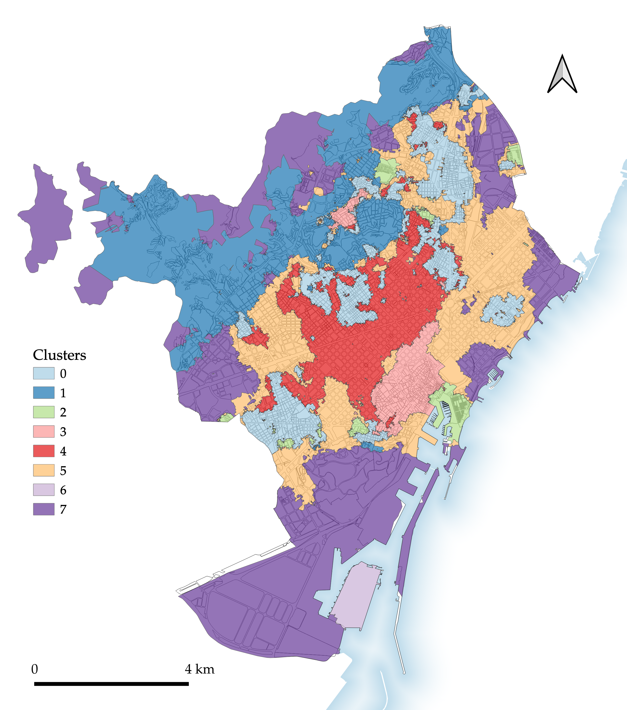
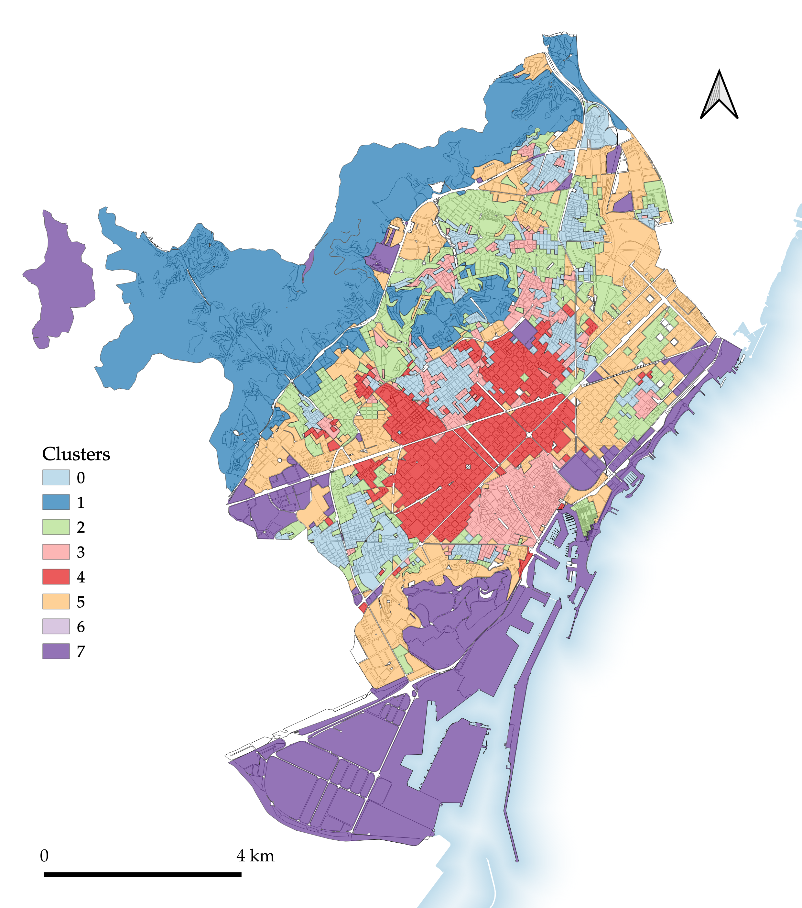
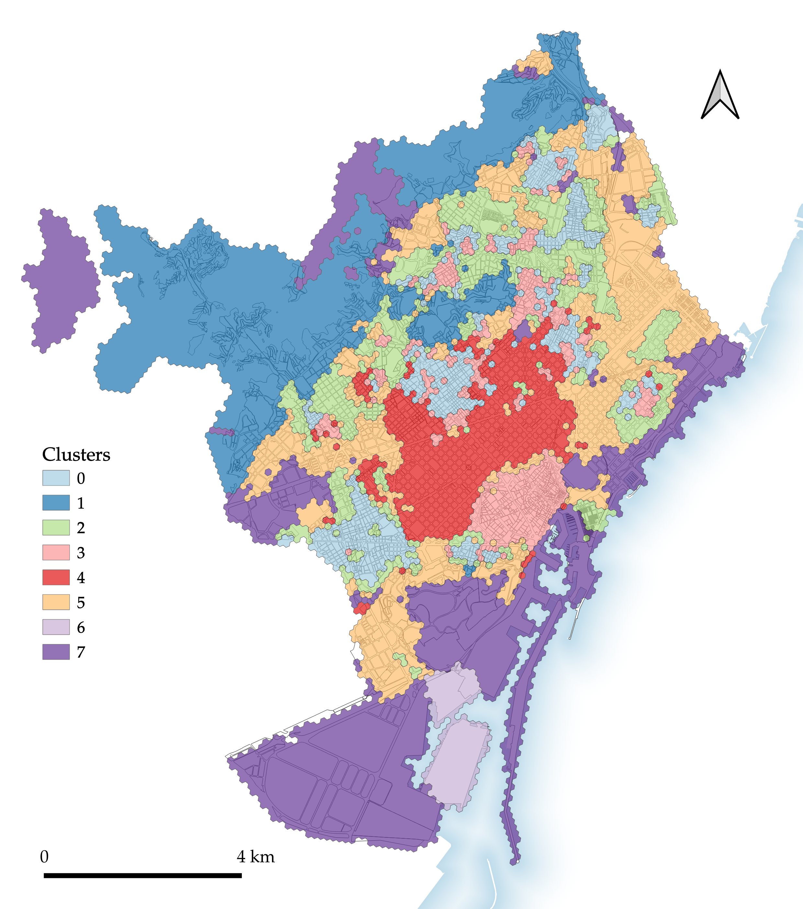
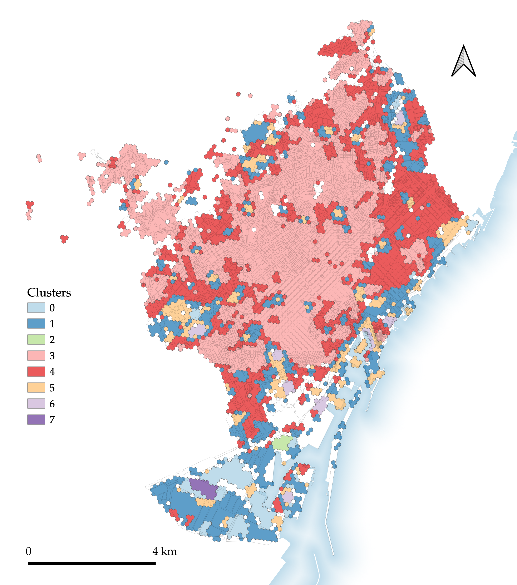
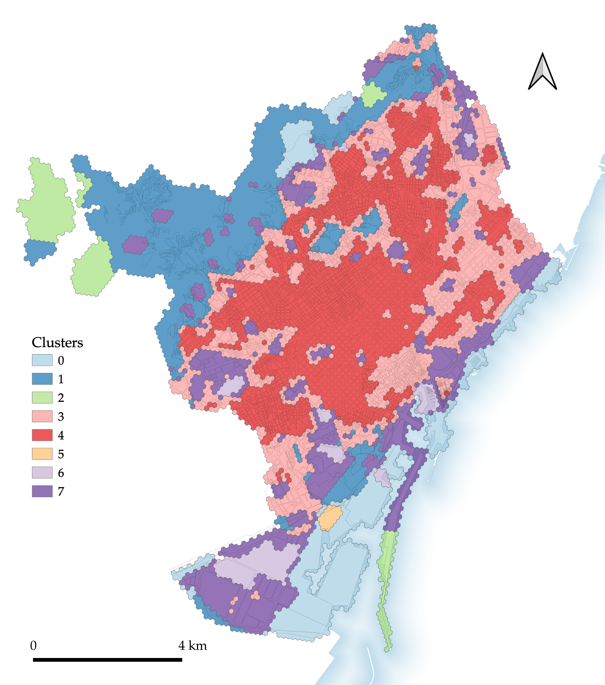
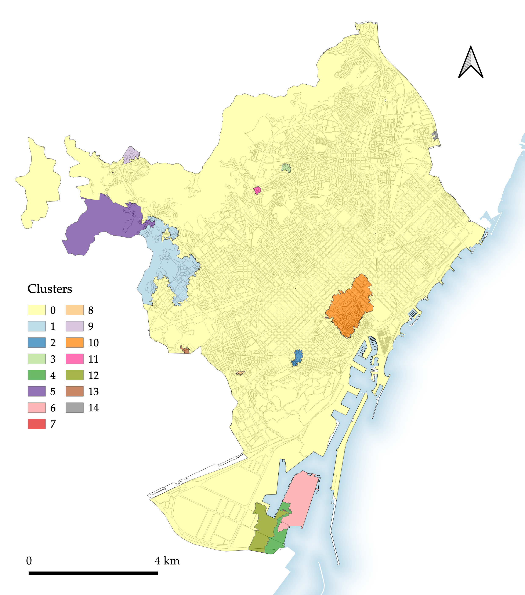
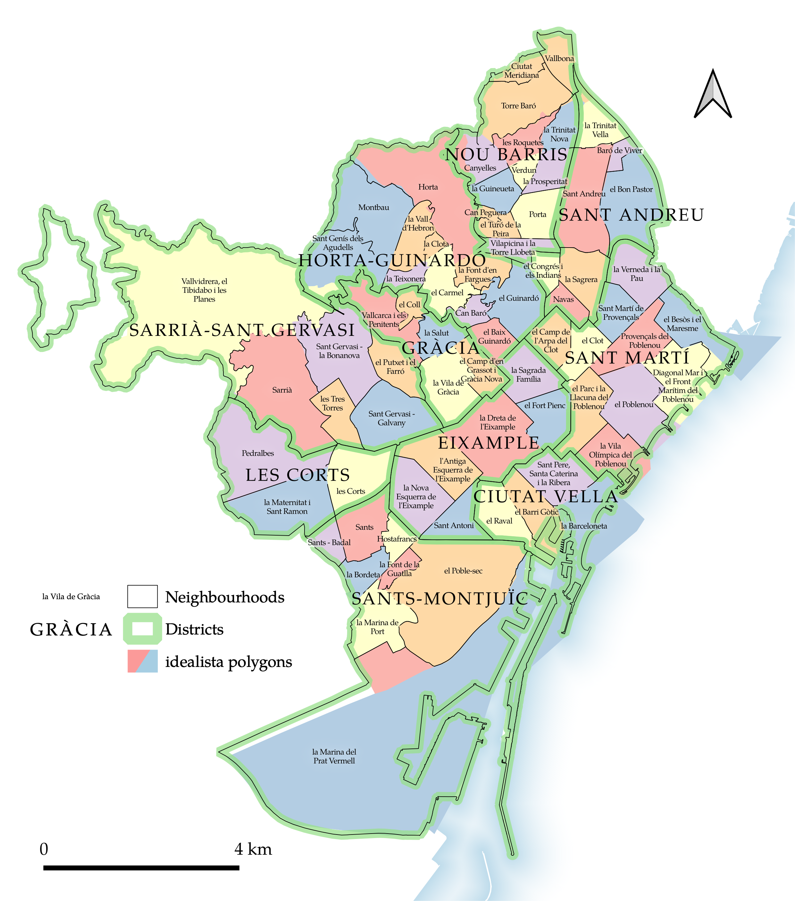

---
output:
  bookdown::pdf_document2:
    template: templates/brief_template.tex
    citation_package: biblatex
  #bookdown::word_document2: default
  #bookdown::html_document2: default
documentclass: book
bibliography: references.bib
editor_options: 
  chunk_output_type: inline
---

# Results {#results}

\minitoc <!-- this will include a mini table of contents-->

This chapter reports the key results of the research presented in this dissertation. First, the different segmentations introduced in the [previous chapter](#comparing-different-segmentations) are reported, and the relationship of these to patterns of urban morphology is qualitatively examined. Second, the results of the quantitative evaluation of the relationship between each segmentation and house prices are reported.

Further supplementary results are reported in the [Appendix](#additional-figures).

## Relationship to urban morphology

Perhaps the most intuitive way to compare the seven segmentations presented in this dissertation is graphically. Figures \@ref(fig:MT-map-BCN) through \@ref(fig:constrained-map-BCN) map the way each segmentation partitions the city of Barcelona. While the scale of these city-level maps limits the amount of detail which each can show, sites of particular interest in certain segmentations are highlighted throughout the [Discussion](#discussion).

<!--# each of the segmentations can also be explored via a web map -->

It should be noted that clusters have been coloured with the same colours where a clear equivalence is perceptible (for example when identified, the cluster most closely corresponding to the Ciutat Vella is [pink]{highlight="ciutatvella"}), but these are so coloured for ease of comparison only and should not be taken to indicate any formal connection between the clusters produced by different segmentations.

```{r MT-map-BCN, echo=FALSE, fig.cap="Segmentation 1: Morphological tessellation.", fig.scap="Segmentation 1: Morphological tessellation.", message=FALSE, fig.align='center', out.width=".8\\paperwidth"}

```

```{r ET-map-BCN, echo=FALSE, fig.cap="Segmentation 2: Enclosed tessellation.", fig.scap="Segmentation 2: Enclosed tessellation.", message=FALSE, fig.align='center', out.width=".8\\paperwidth"}

```

```{r ET-block-map-BCN, echo=FALSE, fig.cap="Segmentation 3: Enclosed tessellation transposed to block geometry.", fig.scap="Segmentation 3: ET transposed to block.", message=FALSE, fig.align='center', out.width=".8\\paperwidth"}

```

```{r ET-H3-map-BCN, echo=FALSE, fig.cap="Segmentation 4: Enclosed tessellation transposed to H3 geometry.", fig.scap="Segmentation 4: ET transposed to H3", message=FALSE, fig.align='center', out.width=".8\\paperwidth"}

```

```{r H3-basic-map-BCN, echo=FALSE, fig.cap="Segmentation 5: H3 'basic'.", fig.scap="Segmentation 5: H3 'basic'.", message=FALSE, fig.align='center', out.width=".8\\paperwidth"}

```

```{r H3-ET-chars-map-BCN, echo=FALSE, fig.cap="Segmentation 6: H3 clustering using characters from enclosed tessellation.", fig.scap="Segmentation 6: H3 clustering using ET characters.", message=FALSE, fig.align='center', out.width=".8\\paperwidth"}

```

```{r constrained-map-BCN, echo=FALSE, fig.cap="Segmentation 7: Spatially constrained clustering on morphological tessellation cells.", fig.scap="Segmentation 7: Spatially constrained MT clustering.", message=FALSE, fig.align='center', out.width=".8\\paperwidth"}

```

Although discussed at greater length in the [next chapter](#creating-spatial-segmentations-to-reflect-urban-morphology), a simple initial description of each of the segmentation maps makes clear certain key results. The **morphological tessellation segmentation** (Figure \@ref(fig:MT-map-BCN)) relatively successfully picks out certain key urban tissues, including those of the Ciutat Vella and of the Eixample, although both have clear room for improvement. For example, the [Ciutat Vella type]{highlight="ciutatvella"} also includes a section of the Eixample immediately to the north of the old city, while the [Eixample type]{highlight="eixample"} excludes certain parts of the Eixample ((mis)classified as part of the [pink]{highlight="ciutatvella"} and [orange]{highlight="orange"} types) while also incorporating other areas beyond the Eixample grid.

The **enclosed tessellation segmentation** (Figure \@ref(fig:ET-map-BCN)) identifies similar overall morphological trends to the preceding MT segmentation, but also comprises key differences. Immediately conspicuous are the areas omitted from classification -- those enclosures not containing any buildings. The segmentation is also visibly more 'fragmented' than its MT counterpart, particularly in the northern part of the city.

This fragmented nature is a motivating factor in the development of the next two segmentations, which transpose the ET segmentation to **block** (Figure \@ref(fig:ET-block-map-BCN)) and **H3** (Figure \@ref(fig:ET-H3-map-BCN)) geometries.

The **H3 'basic' segmentation** (Figure \@ref(fig:H3-basic-map-BCN)) tests the performance of a segmentation produced without using ET or MT cells at any point. Its results leave a lot to be desired: despite the use of contextual characters (defined with neighbouring H3 cells), few if any of the segmentation's types or polygons could be said to clearly constitute distinct urban tissues.

The consequent **H3 clustering using ET characters** (Figure \@ref(fig:H3-ET-chars-map-BCN)) somewhat improves on the preceding 'basic' segmentation. While morphologically distinct areas are delineated to some extent, the differentiation of different types is inferior to that found in the ET or MT segmentations.

Finally, a visual inspection of the **spatially constrained segmentation** (Figure \@ref(fig:constrained-map-BCN)) immediately makes obvious the imbalance in the size of its clusters: 90.3% of the total area is assigned to one cluster.

```{r include=FALSE, eval=FALSE}
# what % of total area is the yellow cluster?

polygon$Segmentation %>% unique()
polygon %>% 
  filter(Segmentation == "Spatially constrained MT",
         clusters == 0) %>% 
  select(area) %>% sum()
# yellow cluster = 91198711

polygon %>% 
  filter(Segmentation == "Spatially constrained MT") %>% 
  select(area) %>% sum()
# total area = 100945305

# yellow cluster area %:
91198711/100945305 *100
# 90.34468%
```

## Relationship to house price indices

For each segmentation, multiple metrics are calculated to measure the dispersion within/between the clusters generated. As discussed above, both type and polygon[^results-1] level metrics are reported below.

[^results-1]: As set out in the [previous chapter](#relation-to-property-prices), *type* describes all cells in the city with a certain cluster label, whereas *polygons* refer to the separate geographies of contiguous cells with a certain cluster label.

```{r neighbourhoods-map-BCN, echo=FALSE, fig.cap="Existing spatial units: neighbourhoods, districts, and idealista polygons in Barcelona.", fig.scap="Existing spatial units.", message=FALSE, fig.align='center', out.width=".8\\paperwidth"}

```

In order to allow a comparison between the novel spatial segmentations mapped above and the existing spatial segmentations which may be used to represent spatial housing submarkets, three of the latter are included within the comparison below. The neighbourhoods, districts, and idealista polygons are mapped in Figure \@ref(fig:neighbourhoods-map-BCN). This makes clear the ways in which the idealista polygons are largely coterminous with the city's administrative neighbourhoods, but sometimes merge these neighbourhoods, as with those which form the two orange idealista polygons in Nou Barris[^results-2]; and sometimes separate these neighbourhoods in two, as with la Marina del Prat Vermell at the very South of the city. In other cases the geometry of the original neighbourhoods has been simplified or otherwise altered to create the idealista polygons.

[^results-2]: Ciutat Meridiana, Vallbona, and Torre Baró in the North of the district; and Can Peguera and el Turó de la Peira in the South.

### Type metrics

Table \@ref(tab:types-table) reports the average Quartile Coefficient of Dispersion of the average residential property sale price for all types, the mean of the areas of types in each segmentation, and the number of types included in each segmentation. Also included for each segmentation is a boxplot showing the distribution of these type areas.

```{r types-table, eval=TRUE, message=FALSE, echo=FALSE}
library(knitr)
library(tidyverse)
library(kableExtra)
library(ggrepel)
library(scales)
library(sysfonts)

typology <- read_csv("figures/typology_metrics.csv")

type <- typology %>% 
  # NAs to zero
  mutate(n = replace_na(n, 0)) %>% 
  # new version of QCoD
  mutate(QCoD2 = (`Price Q3` - `Price Q1`) / (`Price Q3` + `Price Q1`)) %>% 
  # from m2 to km2
  mutate(area_km2 = area/1e+6) %>%
  # rename segmentations
  mutate_at('segmentation', ~dplyr::recode(segmentation, 
      "MT8cls5sw" = "Morphological tessellation", 
      "ET8cls5sw" = "Enclosed tessellation",
      "block_from_ET8cls5sw" = "ET transposed to block",
      "H3_from_ET8cls5sw" = "ET transposed to H3",
      "H3_basic_8cls1sw" = "H3 basic",
      "H3_charsfrom_ET8cls5sw" = "H3 with ET characters",
      "constrained_15cls" = "Spatially constrained MT",
      "barris" = "Existing neighbourhoods",
      "districtes" = "Existing districts",
      "polygons_BCN" = "idealista polygons"
      )) %>% 
  # rename some columns
  rename(Segmentation = segmentation)
         #'Number of cadastral parcels' = n

# list to use for box plots in table
type_area_list <- split(type$area_km2, type$Segmentation)

type_area_list <- type_area_list[c("Morphological tessellation", 
                         "Enclosed tessellation",
                         "ET transposed to block",
                         "ET transposed to H3",
                         "H3 basic", "H3 with ET characters",
                         "Spatially constrained MT",
                         "Existing neighbourhoods",
                         "Existing districts", "idealista polygons")]

if (knitr::is_latex_output()) {
type %>%
  group_by(Segmentation) %>%
  dplyr::summarise(`Mean QCoD` = mean(QCoD2, na.rm=TRUE),
                   `Mean` = mean(area_km2, na.rm=TRUE),
                   `Number of units` = n()) %>% 
  add_column(Distribution = "") %>% 
  mutate_at('Mean QCoD', ~formatC(., format = "f", digits = 3)) %>% 
  mutate_at('Mean', ~formatC(., format = "f", digits = 2)) %>% 
  arrange(factor(Segmentation, levels = c("Morphological tessellation", 
                                          "Enclosed tessellation", 
                                          "ET transposed to block", 
                                          "ET transposed to H3", 
                                          "H3 basic", "H3 with ET characters", 
                                          "Spatially constrained MT", 
                                          "Existing neighbourhoods", 
                                          "Existing districts", "idealista polygons"))) %>%
  relocate(Distribution, .after = Mean) %>% 
  kable(booktabs = TRUE, 
        caption="Average type values for each segmentation.", 
        caption.short = "Average type values for each segmentation.") %>% 
  kable_styling(latex_options = "scale_down") %>%
  # column_spec(4, width = "16em") %>% 
  column_spec(4, image = spec_boxplot(type_area_list, width = 500)) %>% 
  add_header_above(c(" " = 2, "Type area (km\\\\textsuperscript{2})" = 2, " " = 1), escape=FALSE)
} else if (knitr::is_html_output()){
  type %>%
  group_by(Segmentation) %>%
  dplyr::summarise(`Mean QCoD` = mean(QCoD2, na.rm=TRUE),
                   `Mean` = mean(area_km2, na.rm=TRUE),
                   `Number of units` = n()) %>% 
  add_column(Distribution = "") %>% 
  mutate_at('Mean QCoD', ~formatC(., format = "f", digits = 3)) %>% 
  mutate_at('Mean', ~formatC(., format = "f", digits = 2)) %>% 
  arrange(factor(Segmentation, levels = c("Morphological tessellation", 
                                          "Enclosed tessellation", 
                                          "ET transposed to block", 
                                          "ET transposed to H3", 
                                          "H3 basic", "H3 with ET characters", 
                                          "Spatially constrained MT", 
                                          "Existing neighbourhoods", 
                                          "Existing districts", "idealista polygons"))) %>%
  relocate(Distribution, .after = Mean) %>% 
  kable(booktabs = TRUE, 
        caption="Average type values for each segmentation.", 
        caption.short = "Average type values for each segmentation.") %>% 
  kable_styling(latex_options = "scale_down") %>%
  # column_spec(4, width = "16em") %>% 
  column_spec(4, image = spec_boxplot(type_area_list, width = 500)) %>% 
  add_header_above(c(" " = 2, "Type area (km^2^)" = 2, " " = 1), escape=FALSE)
}
  
# typology %>%
#   filter(segmentation == "block_from_ET8cls5sw")
# missing two clusters??
```

Figure \@ref(fig:every-type-graph) plots each type from each segmentation, comparing its area (on the *x*-axis) with the QCoD of house prices within the type (on the *y*-axis). It shows a definite relationship between these two variables, and for this reason the average QCoD alone (provided in Table \@ref(tab:types-table)) is insufficient to make a fair comparison of how well segmentations capture variations in property prices: all else being equal, larger areas will tend to have larger dispersions. By plotting both the QCoD and the area of the spatial unit whose internal house price dispersion the QCoD records, a better judgement can be made about how well a given segmentation captures variation in house prices *given its area*. Note that in Figure \@ref(fig:every-type-graph), the dot for one type (the largest type in the spatially constrained segmentation) is not displayed, as its area of 91.2km^2^ makes it an extreme outlier.

```{r include=FALSE, echo=FALSE}
# what is the area of the largest type in the spatially constrained segmentation?
type %>% 
  filter(Segmentation == "Spatially constrained MT", clusters == 0) %>% 
  select(area_km2) %>% toString()
```

```{r every-type-graph, fig.cap = "Every type plot by house price QCoD and area.", echo=FALSE, fig.width=9, fig.height=5.5, dev = "cairo_pdf", out.width = '\\textwidth', message=FALSE, warning=FALSE}

# new font who dis
font_add(family = "TeX Gyre Pagella", 
         regular = "/Library/Fonts/texgyrepagella-regular.otf",
         bold = '/Library/Fonts/texgyrepagella-bold.otf',
         italic = '/Library/Fonts/texgyrepagella-italic.otf',
         bolditalic = '/Library/Fonts/texgyrepagella-bolditalic.otf')

# each typology separately
type %>% 
  ggplot(aes(area_km2, QCoD2, colour = Segmentation, size = n)) +
  geom_point() +
  xlim(0, 35) +
  scale_colour_brewer(palette = "Paired") +
  scale_size(range = c(0.5,5)) +
  labs(x = expression("Type area (km"^2*")"), y = 'Type QCoD of house price') +
  guides(size = guide_legend(title="Number of corresponding\ncadastral parcels")) +
  theme_minimal() +
  theme(legend.position="right",
        text=element_text(family="TeX Gyre Pagella"))
```

Because Figure \@ref(fig:every-type-graph) plots every type separately, it is difficult to make a clear judgement about how well a segmentation performs overall. This is evident by the spread of dots of the same colour in different areas of the chart: while one type within a segmentation may have a low QCoD, this may be offset by other types within the same segmentation having much greater dispersion. In order to allow better judgements of the overall performance of segmentations, Figure \@ref(fig:avg-type-graph) therefore plots the average areas of the types in each segmentation against the corresponding average house price QCoDs, allowing the direct comparison of each segmentation's average values for these two metrics. The grey line plots a simple linear regression model fit to the points on the graph. Although clearly a poor predictor of the average QCoD of a given segmentation, the line serves as a visual aid in understanding how well a segmentation can be seen to capture house price dispersion, given the size of the units into which it partitions space (in this case, the different types). Segmentations plot below the line can be seen to have lower levels of dispersion given the average areas of their types, and therefore better capture variation in house prices. Conversely, segmentations plot above the line can be seen to have higher QCoD values than might be expected given the average areas of their types, and therefore perform worse as a delineation of housing submarkets.

It should be noted that this system of interpretation is not derived from any particular empirical base, but rather the plots provide a useful heuristic for comparing the performance of segmentations which divide space into different numbers of units of different sizes.

```{r avg-type-graph, fig.cap = "Segmentation averages of typologies plot by house price QCoD and area.", echo=FALSE, fig.width=7, fig.height=5, dev = "cairo_pdf", out.width = '\\textwidth', message=FALSE, warning=FALSE}

# average values for each segmentation
type %>%
  group_by(Segmentation) %>%
  dplyr::summarise(avg_QCoD = mean(QCoD2, na.rm=TRUE),
                   avg_area = mean(area_km2, na.rm=TRUE)) %>%
  ggplot(aes(avg_area, avg_QCoD)) +
  geom_point() +
  geom_smooth(method = "lm",
              se = F,
              colour = 'grey',
              fill = 'chartreuse',
              alpha = 0.2) +
  coord_cartesian(clip = "off") +
  geom_text_repel(
    aes(label=Segmentation),
    xlim = c(-3, Inf), ylim = c(0, Inf),
    min.segment.length = 0,
    point.padding = 0,
    box.padding = 0.5,
    bg.color = "white",
    bg.r = 0.2,
    family = "TeX Gyre Pagella"
  ) +
  xlim(0, 20) +
  labs(x = expression("Mean type area (km"^2*")"), y = 'Mean type QCoD of house price') +
  # scale_colour_brewer(palette = "Paired") +
  theme_minimal() +
  theme(legend.position="bottom",
        text=element_text(family="TeX Gyre Pagella"))
```

### Polygon metrics {#polygon-metrics}

Treating each type---each colour on the segmentation map---as the ultimate spatial unit generated by the segmentation process is one way of assessing the segmentations. Alternatively, each *polygon* produced can be seen as a separate spatial unit: in this conceptualisation, areas which are assigned the same cluster label---the same colour on the map---but are located in different parts of the city will be counted as separate units.

Table \@ref(tab:polygons-table) shows the average results of the same statistics as Table \@ref(tab:types-table) for the same segmentations, but calculated at the polygon level rather than the type level.

As a generality, the smaller a unit is, the fewer house price data points it is likely to contain: larger units are therefore generally more robust when calculating the QCoD, and types more robust than polygons. Because many of the polygons have very small areas (notably those composed of a single or very few MT or ET cells), many contain few cadastral parcels with attached house price information: of the 3,721 polygons into which the ten segmentations examined here are divided[^results-3], 1,732 (46.5%) correspond to fewer than ten house price data points, including 632 (17%) with no corresponding cadastral parcels. Figure \@ref(fig:house-price-coverage) demonstrates that there is also a geographical pattern to this validation data, meaning that certain kinds of types and polygons are more likely to have few or no relevant data from which to calculate the QCoD.

[^results-3]: Seven novel and three existing.

This makes a calculation of the QCoD for house prices within these polygons at best not robust and at worst impossible. For this reason, the averages shown in Table \@ref(tab:polygons-table) and plot in Figure \@ref(fig:avg-polygon-graph) exclude polygons containing fewer than ten house price data points. As these polygons only contain a few cadastral parcels which are geographically proximate and therefore likely also numerically proximate in terms of average house price, their QCoD is likely to be low: there is likely to be minimal dispersion in an area containing only a few properties. Including these polygons would therefore have weighted the average QCoD values to suggest lower levels of dispersion, but only on the grounds of including many small polygons, which would likely not be seen as constituting distinct housing submarkets. A version of Figure \@ref(fig:avg-polygon-graph) which does not exclude these polygons in its calculations is provided in [Appendix A](#additional-figures) as Figure \@ref(fig:avg-polygon-graph-all-points).

The polygon area distribution boxplots are again shown alongside the average area value, but the range for these has been artificially truncated: values (all outliers) larger than 18km^2^ are beyond the range of the plot. Because the types and polygons for the spatially constrained segmentation are identical (since spatial contiguity is a condition of the clustering process, so the types it generates cannot be multipart geometries[^results-4]), the 91.2km^2^ type discussed previously is also counted as a polygon[^results-5]. If plotted with a range inclusive of this polygon, the majority of the other boxplots would be rendered illegible, so for this reason the range is limited.

[^results-4]: Except in the few cases where the city boundary itself contains separate geometries, such as islands.

[^results-5]: Or to be more precise, the large majority of the type is counted as a polygon: as can be seen in Figure \@ref(fig:constrained-map-BCN), it also encompasses two islands (one literal and one figurative), which are counted as separate polygons.

The different units represented in the two tables is evident when comparing the 'Number of units' column in each table: in Table \@ref(tab:types-table) this reports the number of types (eight for the enclosed tessellation segmentation; the same when it is transposed to the H3 geometry), while in Table \@ref(tab:polygons-table) this reports the number of polygons (1,666 for the enclosed tessellation segmentation; reducing to 249 when this is transposed to the H3 geometry). This difference is also reflected in the areas of the units: polygons tend to be much smaller than the types to which they belong.

Because the types and polygons of the existing spatial units (neighbourhoods, districts, and idealista polygons) are spatially coterminous (their types include few or no multipart geometries), they show the fewest changes when comparing types with polygons.

```{r polygons-table, eval=TRUE, fig.cap="caption", fig.scap="short caption", message=FALSE, echo=FALSE, warning=FALSE}

polygon_OG <- read_csv("figures/polygon_metrics.csv")

polygon <- polygon_OG %>% 
  # new version of QCoD
  mutate(QCoD2 = (`Price Q3` - `Price Q1`) / (`Price Q3` + `Price Q1`)) %>% 
  # from m2 to km2
  mutate(area_km2 = area/1e+6) %>%
  # rename segmentations
  mutate_at('segmentation', ~dplyr::recode(segmentation, 
      "MT8cls5sw" = "Morphological tessellation", 
      "ET8cls5sw" = "Enclosed tessellation",
      "block_from_ET8cls5sw" = "ET transposed to block",
      "H3_from_ET8cls5sw" = "ET transposed to H3",
      "H3_basic_8cls1sw" = "H3 basic",
      "H3_charsfrom_ET8cls5sw" = "H3 with ET characters",
      "constrained_15cls" = "Spatially constrained MT",
      "barris" = "Existing neighbourhoods",
      "districtes" = "Existing districts",
      "polygons_BCN" = "idealista polygons"
      )) %>% 
  # rename some columns
  rename(Segmentation = segmentation)

# list to use for box plots in table
poly_area_list <- split(polygon$area_km2, polygon$Segmentation)

poly_area_list <- poly_area_list[c("Morphological tessellation", 
                         "Enclosed tessellation",
                         "ET transposed to block",
                         "ET transposed to H3",
                         "H3 basic", "H3 with ET characters",
                         "Spatially constrained MT",
                         "Existing neighbourhoods",
                         "Existing districts", "idealista polygons")]

# table
if (knitr::is_latex_output()) {
polygon %>%
  filter(n>10) %>% # only polygons w enough house price data points
  group_by(Segmentation) %>%
  dplyr::summarise(`Mean QCoD` = mean(QCoD2, na.rm=TRUE),
                   `Mean` = mean(area_km2, na.rm=TRUE),
                   `Number of units` = n()) %>% 
  add_column(Distribution = "") %>% 
  mutate_at('Mean QCoD', ~formatC(., format = "f", digits = 3)) %>% 
  mutate_at('Mean', ~formatC(., format = "f", digits = 2)) %>% 
  arrange(factor(Segmentation, levels = c("Morphological tessellation", 
                                          "Enclosed tessellation", 
                                          "ET transposed to block", 
                                          "ET transposed to H3", 
                                          "H3 basic", "H3 with ET characters", 
                                          "Spatially constrained MT", 
                                          "Existing neighbourhoods", 
                                          "Existing districts", "idealista polygons"))) %>%
  relocate(Distribution, .after = Mean) %>% 
  kable(booktabs = TRUE, 
        caption="Average polygon values for each segmentation.",
        caption.short = "Average polygon values for each segmentation.") %>%
  kable_styling(latex_options = "scale_down") %>%
  column_spec(4, image = spec_boxplot(poly_area_list, width = 500, lim = c(0,18))) %>%
  add_header_above(c(" " = 2, "Type area (km\\\\textsuperscript{2})" = 2, " " = 1), escape=FALSE)
} else if (knitr::is_html_output()){
  polygon %>%
  filter(n>10) %>% # only polygons w enough house price data points
  group_by(Segmentation) %>%
  dplyr::summarise(`Mean QCoD` = mean(QCoD2, na.rm=TRUE),
                   `Mean` = mean(area_km2, na.rm=TRUE),
                   `Number of units` = n()) %>% 
  add_column(Distribution = "") %>% 
  mutate_at('Mean QCoD', ~formatC(., format = "f", digits = 3)) %>% 
  mutate_at('Mean', ~formatC(., format = "f", digits = 2)) %>% 
  arrange(factor(Segmentation, levels = c("Morphological tessellation", 
                                          "Enclosed tessellation", 
                                          "ET transposed to block", 
                                          "ET transposed to H3", 
                                          "H3 basic", "H3 with ET characters", 
                                          "Spatially constrained MT", 
                                          "Existing neighbourhoods", 
                                          "Existing districts", "idealista polygons"))) %>%
  relocate(Distribution, .after = Mean) %>% 
  kable(booktabs = TRUE, 
        caption="Average polygon values for each segmentation.",
        caption.short = "Average polygon values for each segmentation.") %>%
  kable_styling(latex_options = "scale_down") %>%
  column_spec(4, image = spec_boxplot(poly_area_list, width = 500, lim = c(0,18))) %>%
  add_header_above(c(" " = 2, "Type area (km^2^)" = 2, " " = 1), escape=FALSE)
}

```

Figure \@ref(fig:every-polygon-graph) replicates Figure \@ref(fig:every-type-graph), but reporting the values for polygons and not types. In order to more clearly show the spread of values, the area of polygons is mapped to the *x*-axis logarithmically: as shown in the axis label, each axis tick multiplies by a factor of ten (0.1 km^2^, 1 km^2^, 10 km^2^, etc). This is made necessary by the distribution of areas among the polygons being examined: while there are a few notable polygons with large areas[^results-6], there are many with very small areas. 53.4% of polygons are smaller than 0.01 km^2^ (10,000 m^2^, or about the size of Liverpool's Abercromby Square) and 34.2% of polygons are smaller than 0.001 km^2^ (1,000 m^2^, or about a twelfth the size of a block in the Eixample).

[^results-6]: Of the 3,721 polygons into which the ten segmentations examined here are divided, 185 (5%) have an area of more than 1 km^2^; 32 (0.86%) have an area of more than 5 km^2^; and 16 (0.43%) have an area of more than 10 km^2^.

```{r eval=FALSE, include=FALSE}

polygon %>% nrow() 
# 3721

polygon %>% 
  filter(n<10) %>% nrow()
# 1732

# how many polygons don't have cadastral data?
sum(is.na(polygon$n))
# 632

polygon %>%
  group_by(Segmentation) %>%
  dplyr::summarise(`Number of units` = n())

polygon %>% 
  filter(area_km2<0.001) %>% nrow()
# 1273

polygon %>% 
  filter(area_km2<0.01) %>% nrow()
# 2009

polygon %>% 
  filter(area_km2>10) %>% nrow()
# 16

polygon %>% 
  filter(area_km2>5) %>% nrow()
# 32

polygon %>% 
  filter(area_km2>1) %>% nrow()
# 185
```

```{r every-polygon-graph, fig.cap = "Every polygon plot by house price QCoD and area.", echo=FALSE, fig.width=9, fig.height=5.5, dev = "cairo_pdf", out.width = '\\textwidth', message=FALSE, warning=FALSE}
# each polygon separately
polygon %>% 
  # filter(n > 10) %>% 
  ggplot(aes(area_km2, QCoD, colour = Segmentation, 
             # alpha = n^0.01,
             size = n)) +
  geom_point() +
  # xlim(0, 35) +
  scale_colour_brewer(palette = "Paired") +
  scale_size(range = c(0.3,5)) +
  scale_x_continuous(trans = 'log10', 
                     labels = function(x) sprintf("%g", x),
                     limits = c(0.00005,100),
                     breaks=breaks_log(6)) +
  labs(x = expression("Polygon area (km"^2*")"), y = 'Polygon QCoD of house price') +
  guides(size = guide_legend(title="Number of corresponding\ncadastral parcels"),
         alpha = "none") +
  theme_minimal() +
  theme(legend.position="right",
        text=element_text(family="TeX Gyre Pagella"))
```

Figure \@ref(fig:avg-polygon-graph) replicates Figure \@ref(fig:avg-type-graph), but again reporting the values for polygons and not types.

```{r avg-polygon-graph, fig.cap = "Segmentation averages of polgyons plot by house price QCoD and area.", echo=FALSE, fig.width=7, fig.height=5, dev = "cairo_pdf", out.width = '\\textwidth', message=FALSE, warning=FALSE}

# average values for each segmentation
polygon %>% 
  filter(n>10) %>% # only polygons w enough house price data points
  group_by(Segmentation) %>% 
  dplyr::summarise(avg_QCoD = mean(QCoD, na.rm=TRUE),
                   avg_area = mean(area_km2, na.rm=TRUE)) %>% 
  ggplot(aes(avg_area, avg_QCoD)) +
  geom_point() +
  geom_smooth(method = "lm", 
              se = F, 
              colour = 'grey',
              fill = 'chartreuse',
              alpha = 0.2) +
  coord_cartesian(clip = "off") +
  geom_text_repel(
    aes(label=Segmentation),
    xlim = c(-1.5, 9), ylim = c(0, Inf),
    min.segment.length = 0,
    point.padding = 0,
    box.padding = 0.5,
    bg.color = "white",
    bg.r = 0.2,
    family = "TeX Gyre Pagella"
  ) +
  scale_x_continuous(breaks=seq(0,8,2), limits = c(-1,11)) +
  scale_y_continuous(labels = function(x) sprintf("%g", x)) +
  labs(x = expression("Mean polygon area (km"^2*")"), y = 'Mean polygon QCoD of house price') +
  # scale_colour_brewer(palette = "Paired") +
  theme_minimal() +
  theme(legend.position="bottom",
        text=element_text(family="TeX Gyre Pagella"))
```

```{r, include=FALSE, eval=FALSE, fig.cap="Initial set of urban morphometric characters. Those included in the H3 clustering are indicated with *.", fig.scap="Initial set of urban morphometric characters.", message=FALSE, echo=FALSE}

#### not executed or shown when knit

library(knitr)
library(tidyverse)
library(kableExtra)

typology <- read_csv("figures/typology_metrics.csv")

typology %>% 
  mutate(n = replace_na(n, 0))

library(ggplot2)
library(ggrepel)
library(scales)

# python QCoD
typology %>% 
  ggplot(aes(area, QCoD)) +
  geom_point()

typology <- typology %>% 
  # new version of QCoD
  mutate(QCoD2 = (`Price Q3` - `Price Q1`) / (`Price Q3` + `Price Q1`)) %>% 
  # from m2 to km2
  mutate(area_km2 = area/1e+6) %>%
  # rename segmentations
  mutate_at('segmentation', ~dplyr::recode(segmentation, 
      "MT8cls5sw" = "Morphological tessellation", 
      "ET8cls5sw" = "Enclosed tessellation",
      "block_from_ET8cls5sw" = "ET transposed to block",
      "H3_from_ET8cls5sw" = "ET transposed to H3",
      "H3_basic_8cls1sw" = "H3 basic",
      "H3_charsfrom_ET8cls5sw" = "H3 with ET characters",
      "constrained_15cls" = "Spatially constrained MT",
      "barris" = "Existing neighbourhoods",
      "districtes" = "Existing districts",
      "polygons_BCN" = "idealista polygons"
      )) %>% 
  # rename some columns
  rename(Segmentation = segmentation,
         'Number of cadastral parcels' = n)

# typology <- typology %>% 
#   rename('Number of cadastral parcels' = 'Number of \ncadastral parcels')

# hmmm
# plot(typology$QCoD, typology$QCoD2)

# new font who dis
font_add(family = "TeX Gyre Pagella", 
         regular = "/Library/Fonts/texgyrepagella-regular.otf",
         bold = '/Library/Fonts/texgyrepagella-bold.otf',
         italic = '/Library/Fonts/texgyrepagella-italic.otf',
         bolditalic = '/Library/Fonts/texgyrepagella-bolditalic.otf')

# each typology separately
typology %>% 
  ggplot(aes(area_km2, QCoD2, colour = Segmentation, size = `Number of cadastral parcels`)) +
  geom_point() +
  xlim(0, 35) +
  scale_colour_brewer(palette = "Paired") +
  scale_size(range = c(0.5,5)) +
  labs(x = expression("Typology area (km"^2*")"), y = 'Typology QCoD') +
  guides(size = guide_legend(title="Number of corresponding\ncadastral parcels")) +
  theme_minimal() +
  theme(legend.position="right",
        text=element_text(family="TeX Gyre Pagella"))

# average values for each segmentation
typology %>% 
  group_by(Segmentation) %>% 
  dplyr::summarise(avg_QCoD = mean(QCoD2, na.rm=TRUE),
                   avg_area = mean(area_km2, na.rm=TRUE)) %>% 
  ggplot(aes(avg_area, avg_QCoD)) +
  geom_point() +
  geom_smooth(method = "lm", 
              se = F, 
              colour = 'grey',
              fill = 'chartreuse',
              alpha = 0.2) +
  coord_cartesian(clip = "off") +
  geom_text_repel(
    aes(label=Segmentation),
    xlim = c(-3, Inf), ylim = c(0, Inf),
    min.segment.length = 0,
    point.padding = 0,
    box.padding = 0.5,
    bg.color = "white",
    bg.r = 0.2,
    family = "TeX Gyre Pagella"
  ) +
  xlim(0, 23) +
  labs(x = expression("Mean typology area (km"^2*")"), y = 'Mean typology QCoD') +
  # scale_colour_brewer(palette = "Paired") +
  theme_minimal() +
  theme(legend.position="bottom",
        text=element_text(family="TeX Gyre Pagella"))

```

```{r include=FALSE, eval=FALSE}
polygon_OG <- read_csv("figures/polygon_metrics.csv")

polygon <- polygon_OG %>% 
  # new version of QCoD
  mutate(QCoD2 = (`Price Q3` - `Price Q1`) / (`Price Q3` + `Price Q1`)) %>% 
  # from m2 to km2
  mutate(area_km2 = area/1e+6) %>%
  # rename segmentations
  mutate_at('segmentation', ~dplyr::recode(segmentation, 
      "MT8cls5sw" = "Morphological tessellation", 
      "ET8cls5sw" = "Enclosed tessellation",
      "block_from_ET8cls5sw" = "ET transposed to block",
      "H3_from_ET8cls5sw" = "ET transposed to H3",
      "H3_basic_8cls1sw" = "H3 basic",
      "H3_charsfrom_ET8cls5sw" = "H3 with ET characters",
      "constrained_15cls" = "Spatially constrained MT",
      "barris" = "Existing neighbourhoods",
      "districtes" = "Existing districts",
      "polygons_BCN" = "idealista polygons"
      )) %>% 
  # rename some columns
  rename(Segmentation = segmentation)

polygon %>% 
  filter(n > 10)

polygon %>% 
  group_by(Segmentation) %>% 
  dplyr::summarise(avg_QCoD = mean(QCoD, na.rm=TRUE),
                   avg_area = mean(area_km2, na.rm=TRUE))

# each polygon separately
polygon %>% 
  # filter(n > 10) %>% 
  ggplot(aes(area_km2, QCoD, colour = Segmentation, 
             alpha = n^0.01,
             size = n)) +
  geom_point() +
  # xlim(0, 35) +
  scale_colour_brewer(palette = "Paired") +
  scale_size(range = c(0.3,5)) +
  scale_x_continuous(trans = 'log10', 
                     labels = function(x) sprintf("%g", x),
                     limits = c(0.00005,100),
                     breaks=breaks_log(6)) +
  labs(x = expression("Polygon area (km"^2*")"), y = 'Polygon QCoD') +
  guides(size = guide_legend(title="Number of corresponding\ncadastral parcels"),
         alpha = "none") +
  theme_minimal() +
  theme(legend.position="right",
        text=element_text(family="TeX Gyre Pagella"))
```

```{r include=FALSE, eval=FALSE}
# average values for each segmentation
polygon %>% 
  group_by(Segmentation) %>% 
  dplyr::summarise(avg_QCoD = mean(QCoD, na.rm=TRUE),
                   avg_area = mean(area_km2, na.rm=TRUE)) %>% 
  ggplot(aes(avg_area, avg_QCoD)) +
  geom_point() +
  geom_smooth(method = "lm", 
              se = F, 
              colour = 'grey',
              fill = 'chartreuse',
              alpha = 0.2) +
  coord_cartesian(clip = "off") +
  geom_text_repel(
    aes(label=Segmentation),
    xlim = c(-1.5, 9), ylim = c(0, Inf),
    min.segment.length = 0,
    point.padding = 0,
    box.padding = 0.5,
    bg.color = "white",
    bg.r = 0.2,
    family = "TeX Gyre Pagella"
  ) +
  scale_x_continuous(breaks=seq(0,8,2), limits = c(-1,9)) +
  scale_y_continuous(labels = function(x) sprintf("%g", x)) +
  labs(x = expression("Mean polygon area (km"^2*")"), y = 'Mean polygon QCoD') +
  # scale_colour_brewer(palette = "Paired") +
  theme_minimal() +
  theme(legend.position="bottom",
        text=element_text(family="TeX Gyre Pagella"))
```

<!--# Characterising the typologies of a segmentation section -->
